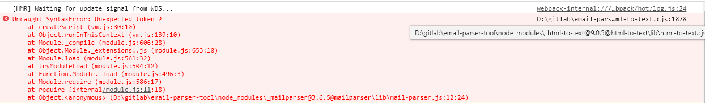

# Email-Parser-Tool

> 邮件eml文件格式化桌面工具，帮助运维和研发人员能够快速、直观的获取eml原文中邮件头部header、模板内容html等重要信息去排查问题。不再需要依赖第三方邮件客户端做转化，导出等一系列繁琐操作。主打一个简单，方便，易操作，让效率翻倍。

## Tech Stack

* [Electron](https://www.electronjs.org/ "electron") (跨平台的桌面应用开发框架， 与之齐名还有Nwjs，也很流行)
* [Electron-vue](https://simulatedgreg.gitbooks.io/electron-vue/content/cn/)
* [Vue2.x + Vuex + Vue-Router]()

## Supporting features

| Features                                             | Support          |
| :--------------------------------------------------- | :--------------- |
| Drag file open or click open                         | Yes              |
| Format headers info                                  | Yes              |
| Remote-IP format & Copy                              | Yes              |
| Template Preview & Download                          | Yes              |
| Attachments show                                     | Yes              |
| Template source code preview & export & online edit | Yes              |
| Dark mode                                            | No (considering) |
| Send test email                                      | No (considering) |

## Build Setup

```bash
# install dependencies
npm install

# serve with hot reload at localhost:9080
npm run dev

# build electron application for production
npm run build


```

## Option Guide

demo show


## 启动可能遇到的问题：

### 1.Uncaught SyntaxError: Unexpected token ?



解决方案：node_modules中找到对应依赖中报错的地方做如下修改：

```javascript
tableToString: (rows) => tableToString(rows, formatOptions.rowSpacing ?? 0, formatOptions.colSpacing ?? 3)
//修改为下面代码
tableToString: (rows) => tableToString(rows, formatOptions.rowSpacing || 0, formatOptions.colSpacing || 3)
```

### 2.Uncaught SyntaxError: Unexpected token .  in D:\gitlab\email-parser-tool\node_modules_peberminta@0.9.0@peberminta\lib\core.cjs:55


解决方案：

```javascript
onEnd?.(data, i);
//修改为改为下面代码
onEnd&&onEnd(data, i);
```

## References：

[Electron 官方文档](https://www.electronjs.org/zh/docs/latest/api/app)

[Vuejs 官方文档](vuejs.org)

[Electron-vue 官方文档](https://simulatedgreg.gitbooks.io/electron-vue/content/cn/)
